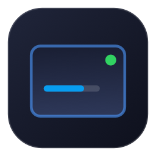
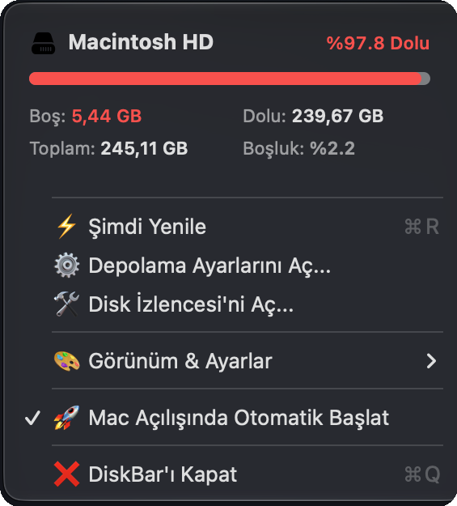

<p align="center">
  
</p>

<h1 align="center">DiskBar</h1>

<p align="center">
  <b>A sleek, ultra-lightweight, cross-platform status bar app that tracks your free disk space in real time.</b>
</p>

<p align="center">
  
  
  
  
  
  <a href="https://github.com/kuarezma/DiskBar/stargazers"></a>
</p>

<p align="center">
  <a href="https://github.com/kuarezma/DiskBar/releases/latest/download/DiskBar.dmg">
    
  </a>
  &nbsp;&nbsp;
  <a href="https://github.com/kuarezma/DiskBar/releases/latest/download/DiskBar-Windows-x64.zip">
    
  </a>
  &nbsp;&nbsp;
  <a href="https://github.com/kuarezma/DiskBar/releases/latest/download/diskbar-linux-amd64.tar.gz">
    
  </a>
</p>

---

## 📸 Screenshots

<p align="center">
  <b>Menu Bar Real-Time Status Pill</b><br/>
  
</p>

<p align="center">
  <b>Drop-Down Storage Card & Controls</b><br/>
  
</p>

---

## 📥 Downloads & Installation

| Platform | Download Link | Format | Description |
|---|---|---|---|
| 🍏 **macOS** | **[DiskBar.dmg](https://github.com/kuarezma/DiskBar/releases/latest/download/DiskBar.dmg)** | `.dmg` | Native Swift / AppKit app with kernel FSEvents |
| 🪟 **Windows** | **[DiskBar-Windows-x64.zip](https://github.com/kuarezma/DiskBar/releases/latest/download/DiskBar-Windows-x64.zip)** / **[DiskBar.exe](https://github.com/kuarezma/DiskBar/releases/latest/download/DiskBar.exe)** | `.zip` / `.exe` | Pure Win32 System Tray executable (No install needed) |
| 🐧 **Linux (x64)** | **[diskbar-linux-amd64.tar.gz](https://github.com/kuarezma/DiskBar/releases/latest/download/diskbar-linux-amd64.tar.gz)** | `.tar.gz` | Statically linked Linux daemon & desktop notifier |
| 🐧 **Linux (ARM)** | **[diskbar-linux-arm64.tar.gz](https://github.com/kuarezma/DiskBar/releases/latest/download/diskbar-linux-arm64.tar.gz)** | `.tar.gz` | Raspberry Pi & ARM64 Linux |

### macOS Installation
- **DMG:** Download `DiskBar.dmg`, open it, and drag `DiskBar` into your `Applications` folder.
- **Terminal (One-Liner):**
  ```bash
  curl -fsSL https://raw.githubusercontent.com/kuarezma/DiskBar/main/install.sh | bash
  ```

### Windows Installation
1. Download **[DiskBar-Windows-x64.zip](https://github.com/kuarezma/DiskBar/releases/latest/download/DiskBar-Windows-x64.zip)** or **[DiskBar.exe](https://github.com/kuarezma/DiskBar/releases/latest/download/DiskBar.exe)**.
2. Double-click `DiskBar.exe`. It runs silently in the bottom-right **System Tray** next to the clock.
3. Right-click the tray icon to view disk stats, refresh, open Windows Storage Sense, or toggle **Run on Windows Startup**.

### Linux Installation
1. Download and extract the archive:
   ```bash
   tar -xzf diskbar-linux-amd64.tar.gz
   chmod +x diskbar-linux-amd64
   ```
2. Enable autostart on login:
   ```bash
   ./diskbar-linux-amd64 --autostart
   ```
3. Run as background service:
   ```bash
   ./diskbar-linux-amd64 --daemon &
   ```

---

## ⚡ Key Features

- **🚀 Real-Time Disk Monitoring:**  
  - **macOS:** Hooks directly into `CoreServices.FSEventStream` for sub-second updates (< 0.8s) when files are created or deleted.
  - **Windows:** Pure Win32 background worker monitoring logical drives with 0% CPU.
  - **Linux:** Fast kernel `statfs` watcher with `notify-send` desktop alerts.
- **🔔 Automatic Update Notifications (macOS):**  
  Whenever a new release is pushed on GitHub, installed macOS users receive a native sound/banner notification and can update in-place with a single click.
- **🍏🪟🐧 100% Native & Zero-Bloat:**  
  No Electron, no Chromium, no heavyweight runtimes. Single compact binaries under 2 MB with **0.0% idle CPU** on all platforms.
- **🎛️ Convenient Context Menus:**  
  Right-click on any platform to access storage management shortcuts, instant refresh, and autostart toggles.
- **🔒 Privacy & Transparency:**  
  100% open-source, completely offline, zero telemetry, zero analytics.

---

## 🛠️ Build All Platforms from Source

Run the unified cross-platform build script on macOS or Linux:

```bash
git clone https://github.com/kuarezma/DiskBar.git
cd DiskBar
./build_all.sh
```

---

## 🇹🇷 Türkçe Açıklama

**DiskBar**, artık **macOS**, **Windows** ve **Linux** işletim sistemlerinin tamamını destekleyen, menü çubuğunda / sistem tepsisinde (System Tray) diskinizde ne kadar boş alan kaldığını canlı olarak gösteren yerel bir uygulamadır.

- **macOS:** Menü çubuğunda canlı disk halkası ve kartı (`DiskBar.dmg`).
- **Windows:** Sağ altta saat yanındaki sistem tepsisinde canlı doluluk ve sağ tık menüsü (`DiskBar.exe`). Kurulum gerektirmez, taşınabilirdir.
- **Linux:** GNOME / KDE / XFCE bildirimleri ve panel entegrasyonu ile otomatik servis (`diskbar-linux`).
- **Otomatik Bildirim & Tek Tıkla Güncelleme:** GitHub'da yeni bir sürüm yayınladığınızda kullanıcılar bildirim alarak tek tıkla güncelleyebilir.

---

## 📄 License

This project is licensed under the [MIT License](LICENSE).  
Feel free to star ⭐️ the project, open issues, or submit pull requests!
