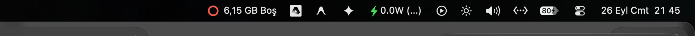
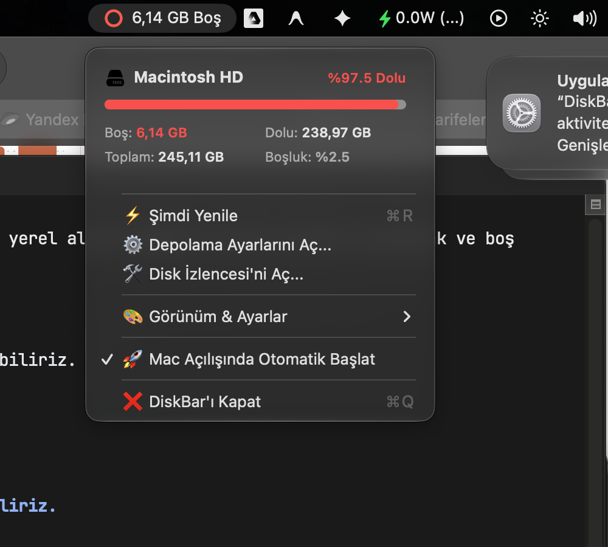
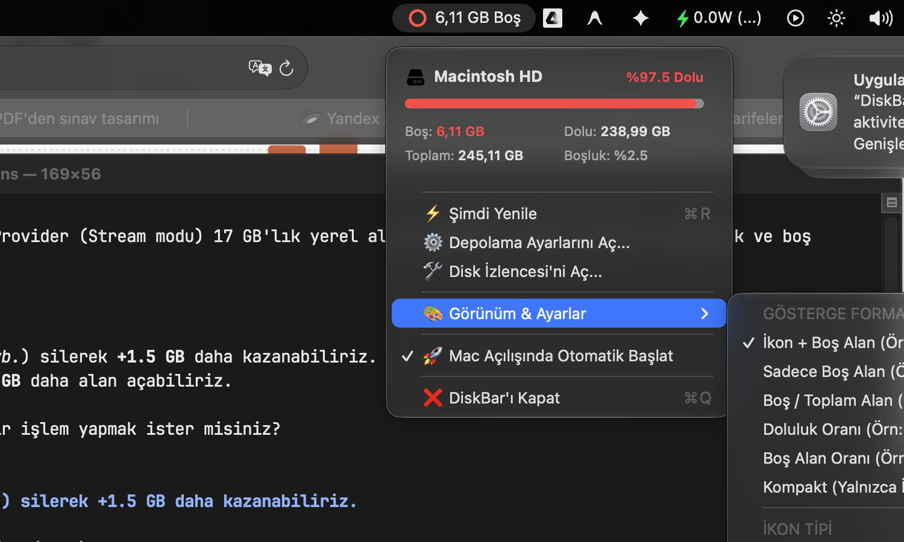

<p align="center">
  
</p>

<h1 align="center">DiskBar for macOS</h1>

<p align="center">
  <b>A sleek, ultra-lightweight, native macOS menu bar app that tracks your free disk space in real time using Apple's kernel FSEvents.</b>
</p>

<p align="center">
  
  
  
  
  
  <a href="https://github.com/kuarezma/DiskBar/stargazers"></a>
</p>

---

## 📸 Screenshots

<p align="center">
  <b>Menü Çubuğu Canlı Göstergesi & Uyarı Halkası</b><br/>
  
</p>

<p align="center">
  
  &nbsp;&nbsp;&nbsp;&nbsp;
  
</p>

---

## ⚡ Features

- **🚀 Real-Time Disk Monitoring via Kernel `FSEvents`:**  
  Unlike standard apps that merely poll every few minutes, DiskBar hooks directly into macOS `CoreServices.FSEventStream`. When you download a file, compile a project, or empty the Trash, your free space updates instantly (< 0.8s) with smart event coalescing.
- **🍏 100% Pure Native & Lightweight:**  
  Zero Electron, zero heavy third-party frameworks. Pure Swift and AppKit. Uses **0.0% CPU** at idle and consumes minimal memory.
- **🎨 Dynamic Circular Gauge & SF Symbols:**  
  Includes a custom-drawn circular progress ring that smoothly tracks space usage. When storage drops below critical levels (< 10 GB or < 10%), it automatically turns red/orange to alert you.
- **🎛️ Elegant Dropdown Card:**  
  Left-click or right-click to reveal a native glass card showing volume details (`Macintosh HD`), usage progress bar, free/used/total capacities, and cache status.
- **⚙️ Deep macOS Integration:**  
  Quick one-click shortcuts to **macOS Storage Settings** (`x-apple.systempreferences:com.apple.settings.Storage`) and **Disk Utility**.
- **🔄 Auto-Start with LaunchAgent:**  
  Seamlessly launches on system login without taking up Dock space (`LSUIElement = true`). Can be toggled on/off with a single click in the menu.
- **❌ Quick Quit Anytime:**  
  Right-click or click to exit cleanly via `DiskBar'ı Kapat (⌘Q)`.

---

## 🚀 Quick Install (One-Liner)

Clone and install with one simple command:

```bash
git clone https://github.com/kuarezma/DiskBar.git ~/DiskBar
cd ~/DiskBar && ./install.sh
```

DiskBar will be compiled natively for your architecture (Apple Silicon / Intel), placed into `~/Applications/DiskBar.app`, and automatically started in your menu bar.

---

## 🛠️ Build from Source

### Requirements
- macOS 12.0 (Monterey) or later
- Xcode Command Line Tools (`xcode-select --install` or Swift toolchain)

### Manual Build
```bash
git clone https://github.com/kuarezma/DiskBar.git
cd DiskBar

# Compile and package .app bundle
./build.sh

# Run as background service
./setup_service.sh
```

---

## 🎨 Display Formats & Customization

You can customize the appearance directly from the **`🎨 Görünüm & Ayarlar`** menu:

| Mode | Format Preview |
|---|---|
| **İkon + Boş Alan** (Default) | `⭕ 6.1 GB Boş` |
| **Sadece Boş Alan** | `6.1 GB Boş` |
| **Boş / Toplam Alan** | `6.1 / 245.1 GB` |
| **Doluluk Oranı** | `%97.5 Dolu` |
| **Kompakt** | `⭕` *(Yalnızca Canlı Halka / İkon)* |

---

## 🇹🇷 Türkçe Açıklama

**DiskBar**, MacBook kullanıcıları için özel olarak geliştirilmiş, menü çubuğunda (sağ üstte) diskinizde ne kadar boş alan kaldığını anlık ve canlı olarak gösteren yerel bir macOS uygulamasıdır.

- **Anlık Takip:** Dosya indirdiğinizde, sildiğinizde veya Xcode çıktısı oluştuğunda macOS çekirdeğinin `FSEvents` mekanizması ile milisaniyeler içinde güncellenir.
- **Sıfır Yük:** Saf Swift/Cocoa ile yazılmıştır; arka planda işlemcinizi yormaz (boşta %0.0 CPU).
- **Kolay Kapatma & Başlatma:** Menü çubuğundaki simgeye tıklayarak `⌘Q` ile dilediğiniz zaman kapatabilir veya Mac açılışında otomatik başlamasını sağlayabilirsiniz.

---

## 📄 License

This project is licensed under the [MIT License](LICENSE).
Feel free to star ⭐️ the project, open issues, or submit pull requests!
